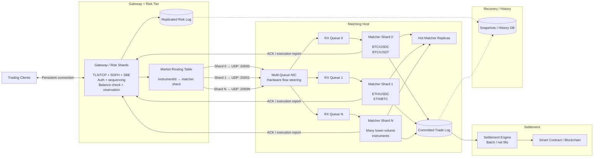

# Design
## Overview

### Load balancer
Assigns a client connection to a gateway. Active connection sticks with the gateway.

### Gateway
Once the gateway sends ACK to the client, the client is can expect that the order was accepted and will be submitted to  
the matching engine.

Functions:
- auth
- order validation
- prerisk checks e.g. account closed, exposure too high etc.
- gap detection
- rate limiting
- instrument - matching engine routing

Deployment:
- is an isolated process so it can be scaled horizontally and vertically

Host config:
- host needs multi queue NICs so the process can read from a dedicated NIC's queue (e.g. by using DPDK)

### Matching engine
Deployment:
- is an isolated process so it can be scaled horizontally and vertically
- hot markets on separate hosts

Host config:
- host needs multi queue NICs so the process can read from a dedicated NIC's queue (e.g. by using DPDK)
- SMT disabled in BIOS
- Turbo Boost enabled in BIOS if tail latency consistency not relevant

## High availability
- for service upgrade, the client can be forcibly disconnected or a `Disconnect` message can be sent to the client so
    it reconnects to a new version of the service process
- if process crashes, the client is disconnected and reconnects to another gateway service where last state is restored
  (if snapshot available or replayed)

## High consistency
| State                    | Consistency owner | Rule                                 |
| ------------------------ | ---------------- | ------------------------------------ |
| Account balances / funds | Account Risk Shard | One writer per account               |
| Order book               | Matching Shard   | One writer per market/shard          |
| Client command stream    | Gateway/session layer | Monotonic `clientSeqNo`              |
| Logical order identity   | Matcher/order layer | Stable `clientOrderId`               |
| Trade history            | Committed trade log | Immutable after commit               |
| Blockchain               | Settlement layer | Eventually reflects committed trades |

## Trade fairness
| Fairness problem          | Our solution                                                                             |
| ------------------------- |------------------------------------------------------------------------------------------|
| Two orders at same price  | Matcher sequence determines priority                                                     |
| Different gateways        | All converge on one shard arbitration point                                              |
| Client timestamps differ  | Ignore for matching priority (we trust only our own timestamps, not client's)            |
| Gateway clocks differ     | Ignore for matching priority (whatever lands first in the matching engine, has priority) |
| Thread scheduling differs | Single-writer matcher                                                                    |
| Matcher crashes           | Replicated ordered command stream preserves priority                                     |
| Cancel vs fill race       | Whichever gets the earlier engine sequence wins                                          |
| Geographic latency        | Not normalized; colocation optional                                                      |

## Robustness to bad clients
We address it primarily at the gateway, before traffic reaches risk or matching:

- Strict protocol validation — reject malformed SOFH/SBE frames, invalid message types, bad lengths, invalid prices/quantities, unsupported instruments, etc.
- Authentication and authorization — verify the account/session and whether it is allowed to trade the requested market.
- Sequence validation — detect duplicates, gaps, stale commands, and invalid reuse of sequence numbers.
- Idempotency — retries with the same clientOrderId cannot accidentally create duplicate orders.
- Rate limiting / quotas — enforce per-account and per-session message limits so one participant cannot exhaust gateway or matcher capacity.
- Bounded buffers and backpressure — never allow a bad client to create unbounded queues; throttle, reject, or disconnect when limits are exceeded.
- Resource isolation — one slow or abusive connection must not block network threads or matching shards used by others.
- Matcher isolation — the matching engine only receives normalized, authenticated, validated internal commands; it never processes arbitrary client bytes.
- Fail closed — invalid or ambiguous commands are rejected rather than guessed or partially processed.
- Monitoring / disconnect policy — repeated protocol violations, excessive gaps, malformed traffic, or abuse can trigger session termination and temporary blocking.

## Scale
### Message throughput
We can have separate matching engine processes (1 per CPU core per market), in practice only hot markets are isolated.

### Limits to participants and connections
Gateway processes can be scaled vertically and horizontally. We do need to be aware to control internal latency to the matching engines.

### Limits to number of symbols (assets)
Low activity markets can be processed in the same process. Otherwise, matching engines scale vertically and horizontally.

